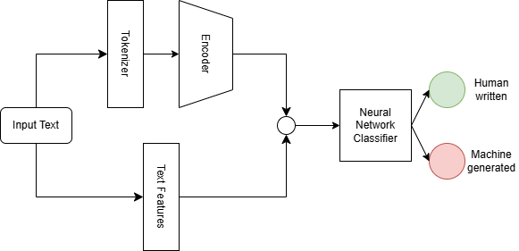

<div align="center">
  <h1>VeriScribbi: The Text Authenticator</h1>
  <p>A simple solution to distinguish human-written text from machine-generated content.</p>
  <p>Project for CS310 NLP, Spring 2025 at SUSTech</p>

[](https://ai-detect.streamlit.app/)  
[](./LICENSE)  
[](https://github.com/Charley-xiao/nlp-project/commits/master)  
[](https://github.com/Charley-xiao/nlp-project/issues)
</div>

> **Note:** *Improvements are in progress for `train.py` – in particular, updating the validation accuracy computation and replacing `roberta-base` with a more recent model. The Streamlit interface continues to evolve for optimal user experience.*

---

## Overview

<div align="center">
  
</div>

**VeriScribbi** is a simple text authentication system that leverages natural language processing and computational linguistics techniques to analyze and classify text, developed as part of the CS310 NLP course. Whether you’re verifying content authenticity or exploring AI's capabilities, VeriScribbi offers a robust, user-friendly platform.

We have also released a [web application](https://ai-detect.streamlit.app/) to demonstrate the model’s real-time classification capabilities. Pre-trained model checkpoints are available [here](TODO) for further experimentation.

---

## Datasets

For comprehensive training and evaluation, we combined two diverse datasets:

1. **[LLM - Detect AI Generated Text Dataset](https://www.kaggle.com/datasets/sunilthite/llm-detect-ai-generated-text-dataset)**  
   A curated collection of text samples specifically generated by AI models, providing diverse examples for robust detection.

2. **[AI Text Detection Pile](https://huggingface.co/datasets/artem9k/ai-text-detection-pile)**  
   A large-scale dataset that aggregates both human-written and machine-generated texts, offering a broad spectrum of linguistic patterns.

*Additional details and statistical analyses of these datasets will be updated soon.*

---

## Setup

Follow these steps to set up your development environment:

1. **Install Dependencies:**

  ```bash
  pip install -r requirements.txt
  ```

2. **Download and Preprocess Data:**

  ```bash
  python utils/download.py
  python utils/preprocess.py
  ```
  The preprocessing script combines and cleans the datasets, saving the final data in the `data/` directory.

---

## Training & Testing

To train and evaluate the model, run:

```bash
python train.py
```

*Note*: The current training script uses an early version of the text encoder in our architecture. We recommend reviewing and updating the validation accuracy metrics and considering an upgrade from `roberta-base` to a more advanced model for enhanced performance. Detailed training logs and configuration options will be documented in the [report](./assets/report.md).

---

## Deployment

Our intuitive Streamlit web app demonstrates VeriScribbi’s real-time classification capabilities. To launch the app locally, run:

```bash
streamlit run app.py
```

---

## Results

Stay tuned!

---

## Contributors

<a href="https://github.com/Charley-xiao/nlp-project/graphs/contributors">
  
</a>

Contributions, suggestions, and collaborations are highly welcomed!

---

## License

This project is licensed under the MIT License. See the [LICENSE](./LICENSE) file for details.